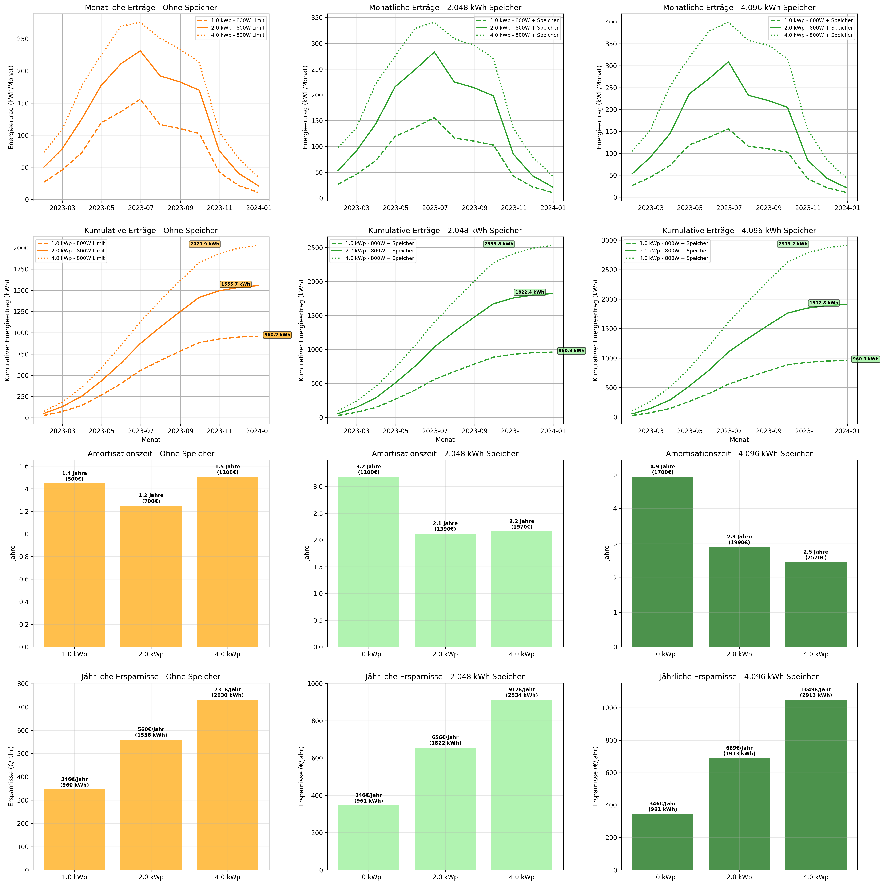

# Balkonkraftwerk Simulation & Wirtschaftlichkeitsanalyse

Ein umfassendes Python-Tool zur Simulation und Wirtschaftlichkeitsanalyse von Balkonkraftwerken mit verschiedenen PV-Modulgrößen und Batteriespeichern.

## 🔋 Projektbeschreibung

Dieses Projekt simuliert die Leistung und Wirtschaftlichkeit von Balkonkraftwerken basierend auf realen Wetterdaten aus Brunsbüttel (Norddeutschland). Es analysiert verschiedene Konfigurationen von PV-Modulen und Batteriespeichern unter Berücksichtigung des 800W-Einspeisezeichens für Balkonkraftwerke.

### Hauptfeatures:
- **📊 Energieertragssimulation** für verschiedene PV-Größen (1.0, 2.0, 4.0 kWp)
- **🔋 Batteriespeicher-Optimierung** (2.048 kWh und 4.096 kWh)
- **💰 Amortisationsberechnung** mit aktuellen Marktpreisen
- **📈 Umfassende Visualisierung** in 4x3 Subplot-Matrix
- **🌍 Reale Wetterdaten** über PVGIS-SARAH3 Datenbank
- **⚡ 800W Einspeisegrenze** entsprechend deutscher Balkonkraftwerk-Regelung

## 🛠️ Installation

### Voraussetzungen
- Python 3.8 oder höher
- `uv` Package Manager (empfohlen) oder `pip`

### Mit uv (empfohlen):
```bash
# Repository klonen
git clone <repository-url>
cd Balkonkraftwerk

# Abhängigkeiten installieren und ausführen
uv run python main.py
```

### Mit pip:
```bash
# Repository klonen
git clone <repository-url>
cd Balkonkraftwerk

# Virtual Environment erstellen
python -m venv venv
source venv/bin/activate  # Linux/Mac
# oder
venv\Scripts\activate     # Windows

# Abhängigkeiten installieren
pip install pvlib pandas matplotlib requests

# Simulation ausführen
python main.py
```

## 📊 Verwendung

Einfach das Skript ausführen:
```bash
uv run python main.py
```

Das Programm:
1. Lädt automatisch Wetterdaten für 2023 aus Brunsbüttel herunter
2. Simuliert alle PV- und Batteriekombinationen
3. Erstellt umfassende Visualisierungen
4. Speichert die Analyse als `balkonkraftwerk_analysis.png`
5. Zeigt detaillierte Wirtschaftlichkeitsanalyse in der Konsole

### Beispiel-Ausgabe:


*Umfassende 4x3 Matrix mit Energieerträgen, Amortisationszeiten und jährlichen Ersparnissen für alle Szenarien*

## 📈 Analysierte Szenarien

### PV-Modulgrößen:
- **1.0 kWp** (gestrichelte Linien)
- **2.0 kWp** (durchgezogene Linien)  
- **4.0 kWp** (gepunktete Linien)

### Speicherkonfigurationen:
- **Ohne Speicher** (nur 800W-Limit)
- **2.048 kWh Speicher** (mit 800W-Limit + Pufferspeicher)
- **4.096 kWh Speicher** (mit 800W-Limit + größerer Pufferspeicher)

### Preismodell (Stand 2024):
| PV-Größe | Ohne Speicher | 2 kWh Speicher | 4 kWh Speicher |
|----------|---------------|----------------|----------------|
| 1.0 kWp  | 500€          | 1.100€         | 1.700€         |
| 2.0 kWp  | 700€          | 1.390€         | 1.990€         |
| 4.0 kWp  | 1.100€*       | 1.970€*        | 2.570€*        |

*Extrapoliert basierend auf verfügbaren Marktdaten

## 📋 Ausgabeformat

### Visualisierungen (4x3 Matrix):
1. **Zeile 1**: Monatliche Energieerträge
2. **Zeile 2**: Kumulative Energieerträge
3. **Zeile 3**: Amortisationszeiten
4. **Zeile 4**: Jährliche Ersparnisse

### Generierte Dateien:
- **`balkonkraftwerk_analysis.png`**: Hochauflösende Visualisierung (300 DPI)
- Interaktive Anzeige der Plots während der Ausführung

### Konsolen-Ausgabe:
- Detaillierte Energieerträge pro Szenario
- Umfassende Amortisationsanalyse
- Empfehlungen für beste Investitionsoption
- Vergleich der Speichereffizienz

## ⚙️ Konfiguration

Die wichtigsten Parameter können in `main.py` angepasst werden:

```python
# Standort (Standard: Brunsbüttel)
latitude = 54.17
longitude = 9.38

# Jahr für Simulation
year = 2023

# Strompreis
electricity_price = 0.36  # €/kWh

# Batterie-Effizienz
max_feed_kw = 0.8  # 800W Einspeisegrenze

# Systemverluste
system_loss_percent = 15
```

## 🔬 Technische Details

### Datenquellen:
- **PVGIS-SARAH3**: Satellitenbasierte Solardaten
- **Standort**: Brunsbüttel (54.17°N, 9.38°E)
- **Ausrichtung**: 35° Neigung, 180° Azimut (Süden)

### Simulationslogik:
- **Ohne Speicher**: Direkte Begrenzung auf 800W
- **Mit Speicher**: Überschussenergie wird gespeichert und bei Bedarf abgegeben
- **Batteriemanagement**: Vollständige Lade-/Entladezyklen mit Kapazitätsgrenzen

### Wirtschaftlichkeitsrechnung:
```
Amortisationszeit = Investitionskosten / (Jährlicher Energieertrag × Strompreis)
Jährliche Ersparnisse = Energieertrag × Strompreis
```

## 📦 Abhängigkeiten

- `pvlib` >= 0.10.0 - PV-Systemmodellierung
- `pandas` >= 1.5.0 - Datenverarbeitung  
- `matplotlib` >= 3.5.0 - Visualisierung
- `requests` >= 2.25.0 - HTTP-Anfragen für PVGIS

## 🤝 Beitragen

Beiträge sind willkommen! Bitte:
1. Fork das Repository
2. Erstelle einen Feature-Branch
3. Committe deine Änderungen
4. Push zum Branch
5. Erstelle einen Pull Request

## 📄 Lizenz

Dieses Projekt steht unter der MIT-Lizenz - siehe [LICENSE](LICENSE) für Details.

## 📞 Kontakt

Bei Fragen oder Anregungen, bitte erstelle ein Issue im Repository.

---

**Hinweis**: Diese Simulation dient nur zu Informationszwecken. Für eine professionelle Planung sollten zusätzliche Faktoren wie Verschattung, Wartung und lokale Vorschriften berücksichtigt werden. 